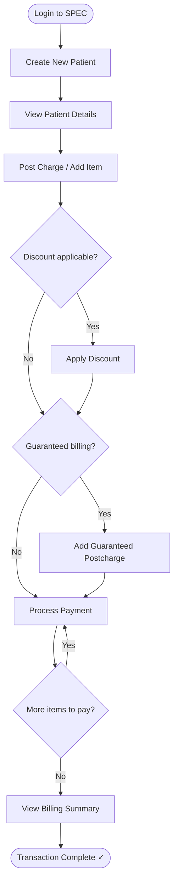

# SPEC Guide — CASHIER Role
## Patient Billing & Charge Management

---

## Your Role

As a **CASHIER**, you manage patient billing from registration to payment. You create patient records, post charges, apply discounts, and process payments.

**Workflow summary:** Create Patient → View Patient → Add Charges → Apply Discount → Process Payment → View Summary

---

## Workflow Flowchart

---

## Step 1 — Login

1. Open SPEC in your browser
2. Enter your **email / username** and **password**
3. Click **Sign In** → you'll land on the main dashboard

---

## Step 2 — Create a New Patient

1. In the left sidebar, click **Patient** or **CMS**
2. Click **+ Create Patient** (top-right corner)
3. Fill in the patient form:

| Field | Required? |
|-------|-----------|
| First Name | ✅ Yes |
| Last Name | ✅ Yes |
| Patient ID / MRN | Optional |
| Date of Birth | Optional |
| Age | Optional |
| Gender | Optional |
| Contact Number | Optional |
| Email | Optional |
| Address | Optional |

4. Click **Register** / **Create Patient**
5. A success message confirms the patient was created

---

## Step 3 — View Patient Details

1. Find the patient in the **Patient List**
2. Click **View Patient** in the Action column
3. The Patient Details page opens with **4 action buttons:**

| Button | Purpose |
|--------|---------|
| **Postcharge** | Add charges to the account |
| **Discount** | Apply a discount |
| **Payment** | Process a payment |
| **Guaranteed Postcharge** | Add a charge to be billed later |

The **Billing Summary Table** below shows all transactions as you work.

---

## Step 4 — Add Charges (Postcharge)

1. Click **Postcharge**
2. Browse the **Available Items** list (item name, unit price, description)
3. Click the item you want to charge — it highlights
4. Set the quantity if needed (default is 1)
5. Click **Apply**
6. The charge appears in the Billing Summary Table

> Repeat this step for every item you need to charge.

---

## Step 5 — Apply a Discount (if applicable)

1. Click **Discount**
2. Select the item you want to discount
3. Choose the **Discount Type:**

| Type | Description |
|------|-------------|
| Senior | Senior citizen discount |
| PWD | Person with disability discount |
| Student | Student discount |
| Employee | Employee discount |
| Other | Other applicable discounts |

4. Review the calculated discount amount
5. Click **Apply**
6. The discount appears in the Billing Summary Table

> Repeat for other items that qualify for discounts.

---

## Step 6 — Process Payment

1. Click **Payment**
2. Browse the **Available Items** — shows outstanding balances
3. Click the item you're collecting payment for
4. The payment amount auto-fills with the balance
   - **Full payment** → leave the amount as-is
   - **Partial payment** → enter the partial amount
5. Select payment method (Cash, Check, Credit Card, etc.) if prompted
6. Click **Apply**
7. Payment is recorded in the Billing Summary Table

> Repeat for each item being paid.

---

## Step 7 — Add Guaranteed Postcharge (if applicable)

Use this for charges that will be billed separately or collected later.

1. Click **Guaranteed Postcharge**
2. Select the item from the Available Items list
3. Click **Apply**
4. The charge appears in the Billing Summary Table as **Guaranteed Postcharge**

> **Note:** Guaranteed postcharges have different collection procedures and are tracked separately.

---

## Step 8 — View Billing Summary

The Billing Summary Table shows all transactions in one view:

| Column | Description |
|--------|-------------|
| Transaction Date | When the transaction was processed |
| Item Name | Service or product name |
| Transaction Type | Charge / Discount / Payment / Guaranteed Postcharge |
| Amount | Transaction amount |
| Balance | Running balance after each transaction |
| Notes | Additional info |

**Account totals to watch:**
- **Total Charges** − Total Discounts − Total Payments = **Final Balance Due**

---

## Quick Tips

✅ **Do:**
- Verify patient identity before adding any charges
- Apply discounts immediately after posting charges when the patient qualifies
- Record payments promptly to keep the account accurate
- Use Guaranteed Postcharge for items to be billed at a later date

❌ **Don't:**
- Add charges without confirming you have the right patient record
- Skip the discount step for qualifying patients (Senior, PWD, etc.)
- Leave transactions unrecorded — all billing needs an audit trail

---

## Need Help?

| Issue | Contact |
|-------|---------|
| System / technical issues | System Administrator |
| Billing policy questions | Supervisor |
| Technical assistance | Support Team |

---

**Version:** 1.0 | **Last Updated:** April 2026 | **Role:** CASHIER
