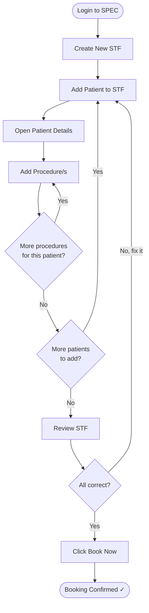

# SPEC Guide — CLIENT Role
## Specimen Transmittal Form (STF) Management

---

## Your Role

As a **CLIENT**, you submit specimen transmittal requests to the lab. You create an STF, add patients, attach the required procedures, and book the transmittal for pickup.

**Workflow summary:** Create STF → Add Patients → Add Procedures → Book Now

---

## Workflow Flowchart

---

## Step 1 — Login

1. Open SPEC in your browser
2. Enter your **email / username** and **password**
3. Click **Sign In** → you'll land on your dashboard

---

## Step 2 — Create a New STF

1. In the left sidebar, click **STF** or **Transmittal**
2. You'll see your STF list
3. Click **+ Create STF** (top-right corner)
4. A success message confirms the STF was created
5. You're now on the **STF Details** page — ready to add patients

---

## Step 3 — Add Patients

1. On the STF Details page, click **+ Add Patient**
2. Fill in the patient form:

| Field | Required? | Notes |
|-------|-----------|-------|
| First Name | ✅ Yes | |
| Last Name | ✅ Yes | |
| Patient ID / MRN | Optional | If your facility uses one |
| Date of Birth | Optional | |
| Age | Optional | |
| Gender | Optional | |
| Contact Number | Optional | |

3. Click **Add Patient** / **Save**
4. The patient appears in the STF patient list
5. Repeat for each patient in this batch

> **To remove a patient:** Click the **Delete** (trash) icon next to their name → confirm. You can do this any time before booking.

---

## Step 4 — Add Procedures to Each Patient

1. In the patient list, click **View Details** for a patient
2. On the Patient Details page, click **+ Add Procedure**
3. Select the procedure from the list (e.g., CBC, Urinalysis, Blood Chemistry)
4. Specify any additional details if prompted:
   - Specimen type (Blood, Urine, etc.)
   - Quantity
   - Special instructions (optional)
5. Click **Add** / **Confirm** — the procedure appears in the list
6. Repeat for all procedures needed for this patient

> **To remove a procedure:** Click **Remove** next to it → confirm.

After finishing this patient, click **Back to STF** and repeat for any remaining patients.

---

## Step 5 — Review and Book

Before booking, confirm the following:

- [ ] All patients have been added
- [ ] Each patient has at least one procedure
- [ ] Patient names and details are correct
- [ ] No extra patients or procedures

Then click **Book Now** (bottom or top-right of the STF page).

A confirmation dialog will show a summary — review it and click **Yes / Confirm Booking**.

**After booking:**
- STF status changes to **Booked / Submitted**
- A booking confirmation number is displayed
- The dispatcher will see your booking and assign a rider

---

## Typical Time Estimates

| Step | Time |
|------|------|
| Create STF | ~1 min |
| Add 1 patient | ~2 min |
| Add 1 procedure | ~1 min |
| Review & Book | ~2 min |
| **Total (2–3 patients, 3–4 procedures)** | **~10–15 min** |

---

## Tips

✅ **Do:**
- Double-check patient names before booking — corrections after booking are harder
- Add all procedures before clicking Book Now
- Keep your STF booking numbers for reference

❌ **Don't:**
- Book an STF with missing procedures
- Use placeholder or incorrect patient data
- Add patients you won't be submitting samples for

---

## Need Help?

| Issue | Contact |
|-------|---------|
| Technical error | IT Support (reference your STF ID) |
| Workflow question | Your supervisor or facility admin |
| Procedure selection | Medical supervisor or procedure manual |

---

**Version:** 1.0 | **Last Updated:** April 18, 2026 | **Role:** CLIENT
