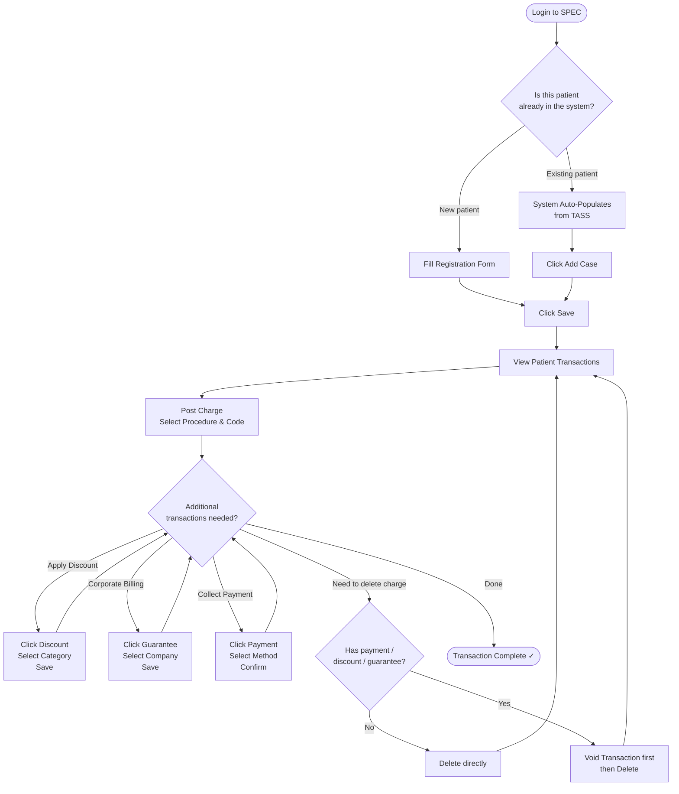

# SPEC Guide — CMS Role
## Patient Registration & Transaction Management

---

## Your Role

As a **CMS** user, you register patients, open cases, and manage all financial transactions — charges, payments, discounts, and corporate guarantees.

**Workflow summary:** Register Patient → View Transactions → Post Charges → Discount / Guarantee / Payment → Done

---

## Workflow Flowchart

---

## Step 1 — Login

1. Open SPEC in your browser
2. Enter your **email / username** and **password**
3. Click **Sign In** → you'll land on the CMS dashboard

---

## Step 2 — Register a Patient

### If the patient already exists in TASS:

1. Click **Register Patient**
2. Begin typing patient details — SPEC automatically searches **TASS** (Treatment And Specimen System)
3. When a match appears, the form **auto-populates** with the existing data
4. Verify the information is correct
5. Click **Add Case** to associate a new case with this patient
6. Click **Save**

### If the patient is new:

1. Click **Register Patient**
2. Fill in the registration form:

| Field | Required? |
|-------|-----------|
| First Name | ✅ Yes |
| Last Name | ✅ Yes |
| Date of Birth | Optional |
| Age | Optional |
| Gender | Optional |
| Contact Number | Optional |
| Email | Optional |
| Address | Optional |

3. Click **Save** — the patient record is created and you're taken to their record page

---

## Step 3 — View Patient Transactions

1. From the patient record, click **View**
2. The **Patient Transactions** page opens with four tabs:

| Tab | What It Shows |
|-----|--------------|
| **Charges** | Medical charges / procedures added |
| **Payment** | Payments received |
| **Discount** | Discounts applied |
| **Guarantee** | Corporate / guarantee billing |

---

## Step 4 — Post a Charge

The **Charges** tab has four action buttons: **Post Charge**, **Discount**, **Guarantee**, **Payment**

To add a new charge:

1. Click **Post Charge**
2. Select the procedure from the list (e.g., Lab test, Consultation)
3. Select the corresponding code
4. Click **Add** to add the item
5. Click **Create** to finalize and save
6. The charge now appears in the Charges tab

> **Post a charge before applying any discount, guarantee, or payment** — all other actions depend on an existing charge.

---

## Step 5 — Process Payment

Applicable for **walk-in patients** paying immediately.

**Accepted payment methods:** Cash · Credit Card · Debit Card · QR Code PH

1. Click **Payment** (in the Charges tab)
2. The payment form shows all charges with amounts due
3. Check the items the patient is paying for (all or partial)
4. Select the payment method
5. Confirm the payment amount
6. Click **Confirm Payment** / **Pay**
7. Charge status updates to **Paid**

---

## Step 6 — Apply a Discount

Applicable for patients in eligible categories.

**Eligible categories:** Senior Citizens · PWD · Indigent · Others

1. Click **Discount** (in the Charges tab)
2. Select the charge you want to discount
3. Choose the applicable discount category
4. Review the calculated discount amount
5. Click **Save**
6. Discount appears in the **Discount** tab

---

## Step 7 — Add a Guarantee (Corporate Billing)

Applicable when a **corporate company** will be billed instead of the patient.

1. Click **Guarantee** (in the Charges tab)
2. Select the applicable procedure
3. Select the corporate account / company
4. Verify the guarantee terms
5. Click **Save**
6. Guarantee appears in the **Guarantee** tab
7. The company will receive a bill for this charge

---

## Step 8 — Delete a Charge

The system enforces rules about when a charge can be deleted:

| Charge State | Can You Delete? | How |
|-------------|----------------|-----|
| No payment, discount, or guarantee | ✅ Yes | Click Delete directly |
| Has payment applied | ❌ Not directly | Void first, then delete |
| Has discount applied | ❌ Not directly | Void first, then delete |
| Has guarantee applied | ❌ Not directly | Void first, then delete |

**To delete a protected charge:**
1. Click **Void Transaction** → confirm
2. After voiding, the charge reverts to initial status
3. Now click **Delete** → confirm

---

## Quick Reference

| Action | Walk-in? | Corporate? | Notes |
|--------|:--------:|:---------:|-------|
| Register Patient | ✅ | ✅ | Auto-populates for existing patients |
| Post Charge | ✅ | ✅ | Required before all other actions |
| Payment | ✅ | ❌ | Walk-in patients only |
| Discount | ✅ | ✅ | Senior, PWD, Indigent, etc. |
| Guarantee | ❌ | ✅ | Corporate accounts only |
| Delete Charge | ✅* | ✅* | Only if no payment / discount / guarantee |

*Void the transaction first if any of those have been applied.

---

## Tips

✅ **Do:**
- Check for existing records before registering — the system auto-populates for known patients
- Post charges first — payment, discount, and guarantee all require a charge to exist
- Process walk-in payments immediately to keep accounts current
- Void before deleting any protected charge

❌ **Don't:**
- Create duplicate patient records — search first
- Apply discounts to non-qualifying patients
- Try to delete a paid charge without voiding it first

---

**Version:** 1.0 | **Last Updated:** April 2026 | **Role:** CMS
