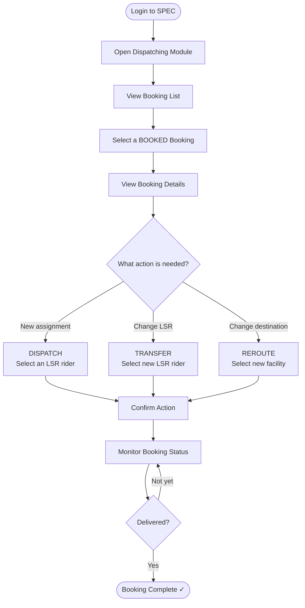

# SPEC Guide — DISPATCHER Role
## Booking Management & Specimen Dispatch

---

## Your Role

As a **DISPATCHER**, you coordinate specimen delivery by assigning bookings to riders (LSRs), transferring to different riders, or rerouting to different destination facilities.

**Workflow summary:** View Bookings → Select Booking → Dispatch / Transfer / Reroute → Monitor Status

---

## Workflow Flowchart

---

## Booking Status Reference

| Status | Meaning | Your Next Action |
|--------|---------|-----------------|
| **DRAFT** | Client hasn't finalized yet | Wait |
| **BOOKED** | Client confirmed — ready to dispatch | Assign to an LSR |
| **DISPATCHED** | Assigned to LSR | LSR will pick up |
| **BOOKING_ACCEPTED** | LSR accepted the booking | Monitor progress |
| **IN_TRANSIT** | Specimens being delivered | Monitor |
| **FORWARDED** | Transferred to a different LSR | Monitor |
| **COMPLETED** | Successfully delivered | Done |

---

## Step 1 — Login

1. Open SPEC in your browser
2. Enter your **email / username** and **password**
3. Click **Sign In** → you'll land on the Dispatcher dashboard

---

## Step 2 — Access the Dispatching Module

1. In the left sidebar, click **Dispatching**
2. The **Booking Management List** opens showing all STF bookings

**Columns in the booking list:**

| Column | Description |
|--------|-------------|
| Booking ID | Unique transmittal ID (e.g., STF-2026-04-18-001) |
| Origin Facility | Where specimens come from |
| Patient Count | Number of patients in this booking |
| Procedure Count | Number of tests ordered |
| Status | Current state |
| Booking Date | When the client created the booking |
| Actions | View button to open details |

---

## Step 3 — View Booking Details

1. Find a **BOOKED** booking in the list
2. Click **View** — the Booking Details panel opens on the right
3. Review:
   - Origin / Destination Facility
   - Patient Information table (name, age, gender, contact)
   - Specimens / Procedures table (test name, specimen type, quantity)
   - Current status with timestamp

The panel shows three action buttons: **DISPATCH**, **TRANSFER**, **REROUTE**

---

## Step 4 — DISPATCH: Assign to an LSR

Use **DISPATCH** when a booking is new and needs a rider assigned.

1. Click **DISPATCH**
2. A dropdown list of available LSR riders appears
3. Select the best LSR for the route:
   - Choose someone **closest to the origin facility**
   - Verify they're **available** (not already busy)
   - Check their service area covers origin → destination
4. Click **Assign to This LSR**
5. Confirm the assignment

**After dispatch:**
- Booking status → **DISPATCHED**
- LSR receives a notification and begins pickup

---

## Step 5 — TRANSFER: Reassign to a Different LSR

Use **TRANSFER** when the assigned LSR becomes unavailable or needs to be swapped.

**Common reasons to transfer:**
- LSR has mechanical issues
- LSR is unavailable / overloaded
- Route optimization needed

**Steps:**
1. Click **TRANSFER**
2. A modal appears — current LSR is highlighted (cannot be reselected)
3. Select a new LSR from the list
4. Optionally add a reason (e.g., "LSR vehicle breakdown")
5. Click **Confirm Transfer**

**After transfer:**
- Old LSR is removed and notified
- New LSR receives assignment notification
- Booking status → **FORWARDED**
- All changes are logged with a timestamp

---

## Step 6 — REROUTE: Change Destination Facility

Use **REROUTE** when specimens need to go to a different lab than originally planned.

**Common reasons to reroute:**
- Destination facility unavailable
- Specific test only available at another facility
- Client requested a different lab

**Steps:**
1. Click **REROUTE**
2. A modal shows the current destination (highlighted)
3. Select a new destination facility
4. Confirm the new facility can perform all required tests
5. Optionally add a reason
6. Click **Confirm Reroute**

**After rerouting:**
- Destination facility is updated
- Assigned LSR is notified of the new delivery location
- New facility is notified of incoming specimens

> **Important:** Verify that the new destination can handle the specimen types and has the required equipment before confirming.

---

## Dashboard Metrics

| Metric | What It Tracks |
|--------|---------------|
| Total Pending | Bookings waiting for dispatch |
| Dispatched Today | Bookings you've assigned today |
| In Transit | Currently being delivered |
| Delivered Today | Completed deliveries |

---

## Best Practices

✅ **Do:**
- Dispatch **BOOKED** bookings within 1 hour of receipt
- Select the LSR closest to the origin facility (shorter pickup = better specimen quality)
- Add clear notes for urgent cases or special handling requirements
- Document all transfers and reroutes with a reason

❌ **Don't:**
- Dispatch without verifying the LSR's service area
- Reroute without confirming the new facility can perform the tests
- Leave bookings in BOOKED status — dispatch promptly
- Skip adding notes for complex or urgent cases

---

## Escalation Guide

| Situation | Contact |
|-----------|---------|
| Booking not appearing in list | System Admin |
| No available LSR | Operations team |
| Destination facility issue | Lab Manager |
| Urgent reassignment needed | Senior Dispatcher |
| Technical problem | IT Help Desk |

---

## KPIs to Track

| Metric | Goal |
|--------|------|
| Assignment Completion Rate | 100% of BOOKED bookings dispatched |
| Average Assignment Time | < 1 hour from booking received |
| On-Time Delivery | ≥ 95% |
| Specimen Integrity | Zero damage / contamination |

---

## Training Checklist

Before dispatching independently, confirm you can:

- [ ] Log in and access the Dispatching module
- [ ] Read and understand all booking list columns
- [ ] Open and review booking details
- [ ] Use DISPATCH to assign a new booking to an LSR
- [ ] Use TRANSFER to reassign to a different LSR
- [ ] Use REROUTE to change the destination facility
- [ ] Understand all booking status values
- [ ] Respond to LSR notifications and issues
- [ ] Escalate when needed

---

**Version:** 1.0 | **Last Updated:** April 18, 2026 | **Role:** DISPATCHER
