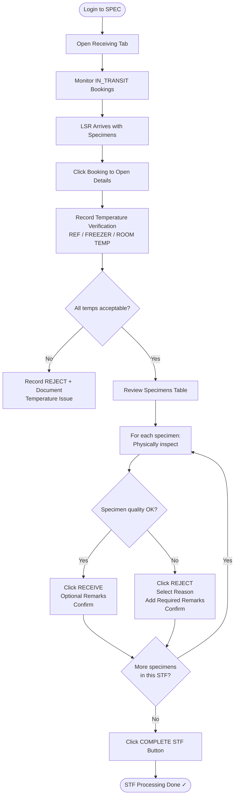

# SPEC Guide — LAB Role
## Laboratory Technician (Specimen Reception & Validation)

---

## Your Role

As a **LAB TECHNICIAN**, you receive incoming specimens delivered by LSR riders, verify compartment temperatures, and accept or reject each specimen based on quality standards.

**Workflow summary:** Receiving Tab → Monitor IN_TRANSIT → Record Temps → Accept/Reject Per Patient → Complete STF

---

## Workflow Flowchart

---

## Step 1 — Login

1. Open SPEC in your browser
2. Enter your **email / username** and **password**
3. Click **Sign In** → you'll land on your LAB dashboard

**Dashboard shows:**
- **Incoming Specimens** — Bookings in transit to your lab
- **Pending Reception** — Ready to be received
- **Received Today** — Already processed
- **Rejected** — Specimens not accepted

---

## Step 2 — Access the Receiving Tab

1. In the left sidebar, click **Receiving**
2. The Receiving Dashboard shows two sections:

| Section | What You See |
|---------|-------------|
| **IN_TRANSIT** | Bookings on their way — click to receive when they arrive |
| **COMPLETE / RECEIVED** | Bookings you've already processed — historical record |

---

## Step 3 — Monitor Incoming Bookings

In the IN_TRANSIT section, each booking shows:

| Column | Description |
|--------|-------------|
| Booking ID | STF reference number |
| LSR Name | Who is delivering |
| Origin Facility | Where specimens came from |
| Patient Count | Number of patients in this STF |
| Specimen Count | Total procedures / tests |
| Expected Arrival | Estimated time |
| Status | IN_TRANSIT or OUT_OF_DELIVERY |

**Prepare while waiting:**
- Set up your receiving area
- Have a thermometer ready
- Alert staff that specimens are arriving

---

## Step 4 — Record Temperature Verification

When the LSR arrives:

1. Click the booking in the IN_TRANSIT section to open it
2. Navigate to **Compartment Temperature Recording**
3. Record your **independent** temperature reading for each compartment:

| Compartment | Acceptable Range | Field to Fill |
|-------------|-----------------|---------------|
| Refrigerated | 2–8°C | REF TEMP LAB VERIFICATION |
| Freezer | −20°C or below | FREEZER TEMP LAB VERIFICATION |
| Room Temperature | 20–25°C | ROOM TEMP LAB VERIFICATION |

> The LSR already recorded their arrival temperatures. Your reading is an independent check-and-balance — record what you actually measure.

4. After recording all temperatures:
   - All in range → Click **PASS**
   - Any out of range → Click **REJECT**, add a note (e.g., "REF temp too warm: 9°C"), notify supervisor
5. Click **Save Temperature Recording**

---

## Step 5 — Receive Each Specimen

Scroll down in the booking details to see the **Specimens Table**. Each row shows:

| Column | Description |
|--------|-------------|
| Patient Name | Who the specimen is from |
| Specimen Type | Whole Blood, Serum, Urine, etc. |
| Procedure / Exam | Which test this is for |
| Compartment | Where it was stored |
| Status | PENDING / RECEIVED / REJECTED |
| Actions | RECEIVE or REJECT buttons |

### To RECEIVE a specimen:

1. Click **RECEIVE** on a PENDING specimen
2. In the Receive Modal, confirm:
   - ☐ Label legible and intact?
   - ☐ Container appropriate for specimen type?
   - ☐ Sufficient volume?
   - ☐ Color / appearance normal?
   - ☐ No leakage or damage?
   - ☐ Temperature maintained?
3. Optionally add remarks (e.g., "Minor label smudge but readable")
4. Click **Confirm Receive** — status changes to **RECEIVED**

### To REJECT a specimen:

1. Click **REJECT** on a PENDING specimen
2. Select the rejection reason from the dropdown:

| Reason | Description |
|--------|-------------|
| MISLABELED | Label doesn't match patient |
| UNLABELED | No label on specimen |
| INSUFFICIENT (QNS) | Not enough volume |
| OVERFILLED | Too much in container |
| HEMOLYZED | Blood cells broken down (red tint) |
| CONTAMINATED | Visible contamination |
| IMPROPER_COLLECTION | Not collected per protocol |
| WRONG_SPECIMEN_TYPE | Wrong type for the ordered test |
| WRONG_CONTAINER | Wrong tube / vial used |
| WRONG_PRESERVATIVE | Wrong additive inside |
| TIME_LAPSE | Specimen too old |
| DELAYED_TRANSPORT | Took too long to deliver |
| WRONG_TEMPERATURE | Not stored at required temp |
| DAMAGED_CONTAINER | Broken or leaking container |
| DAMAGED_ACCIDENT | Lab accident, unsalvageable |
| IMPROPER_HANDLING | Mishandled during transport |

3. Add detailed remarks (**required** for rejections — be specific)
   - Example: "Serum tube only 0.5 mL — minimum 2 mL required"
   - Example: "Specimen shows hemolysis — red tint visible"
4. Click **Confirm Rejection** — status changes to **REJECTED**, dispatcher is notified

---

## Step 6 — Complete the STF

After all specimens in the STF have been received or rejected:

1. Locate the **COMPLETE** button (upper-right corner of the booking details panel)
2. Click **Complete STF** / **Finish Receiving**
3. System verifies all specimens have been reviewed
4. Booking status changes to **COMPLETED** — STF is archived

> **You must click COMPLETE to finalize the STF.** Do not leave it open after processing all specimens.

---

## Rejection Reason Quick Reference

**Label issues:** MISLABELED · UNLABELED

**Volume issues:** INSUFFICIENT (QNS) · OVERFILLED

**Quality issues:** HEMOLYZED · CONTAMINATED

**Collection / handling:** IMPROPER_COLLECTION · IMPROPER_HANDLING · WRONG_SPECIMEN_TYPE · WRONG_CONTAINER · WRONG_PRESERVATIVE

**Timing / temperature:** TIME_LAPSE · DELAYED_TRANSPORT · WRONG_TEMPERATURE

**Damage:** DAMAGED_CONTAINER · DAMAGED_ACCIDENT

---

## Notifications Reference

| Notification | Meaning | Your Action |
|-------------|---------|-------------|
| **New IN_TRANSIT** | Booking on the way | Monitor for arrival |
| **LSR Arrived** | Rider at your facility | Go receive specimens |
| **Temperature Alert** | Compartment out of range | Record and investigate |
| **Specimen Rejected** | You marked as rejected | Awaiting new specimen |
| **STF Complete** | All processing done | Move to next STF |

---

## When to Escalate to Supervisor

| Situation | Action |
|-----------|--------|
| Patient ID mismatch | Stop — escalate immediately |
| Specimen integrity concern you're unsure about | Flag and escalate |
| Equipment malfunction | Stop — report immediately |
| Critical abnormal finding | Notify supervisor |
| Unable to complete a test | Document and escalate |

---

## Performance Targets

| Metric | Target |
|--------|--------|
| QC Pass Rate | 100% |
| Result Accuracy | > 99.5% |
| On-Time Completion | > 95% |
| Approval Rate | > 98% |

---

## Tips

✅ **Do:**
- Always verify temperatures independently (your reading is the check-and-balance)
- Physically inspect every specimen before accepting
- Use standard rejection reasons from the dropdown
- Add clear, specific remarks for all rejections
- Process all specimens before clicking COMPLETE

❌ **Don't:**
- Accept specimens with questionable conditions — when in doubt, reject
- Skip temperature verification
- Leave rejection remarks blank
- Forget to click COMPLETE after processing all specimens
- Accept if patient identity cannot be confirmed

---

**Version:** 1.0 | **Last Updated:** April 18, 2026 | **Role:** LAB
