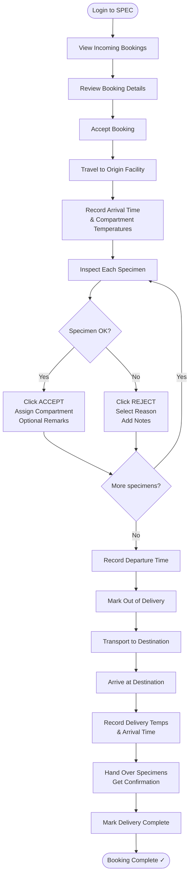

# SPEC Guide — LSR Role
## Logistics Service Representative (Rider / Courier)

---

## Your Role

As an **LSR (Logistics Service Representative)**, you are the courier responsible for picking up specimens at the origin facility and delivering them to the destination (lab). You must handle specimens carefully, record temperatures, and document every step.

**Workflow summary:** Accept Booking → Travel to Origin → Record & Accept Specimens → Transport → Deliver at Destination

---

## Workflow Flowchart

---

## Step 1 — Login

1. Open SPEC in your browser
2. Enter your **email / username** and **password**
3. Click **Sign In** → you'll land on your LSR dashboard

**Dashboard shows:**
- **Incoming Bookings** — Dispatcher has assigned to you
- **Pending Acceptance** — Waiting for your response
- **In Progress** — Active deliveries
- **Delivered** — Completed today

---

## Step 2 — Accept a Booking

1. In the left sidebar, click **My Bookings**
2. The Incoming Bookings list shows all bookings assigned to you
3. Click on a booking to review:
   - Origin Facility (pickup address)
   - Destination Facility (delivery address)
   - Patient count / Procedure list
   - Special notes from dispatcher
4. Click **Accept Booking**
5. Status changes to **Booking Accepted**

> **Only accept when you're ready to leave for pickup immediately.**

---

## Step 3 — Prepare Your Vehicle

Before heading out, verify your delivery vehicle compartments:

| Compartment | Required Temperature |
|-------------|---------------------|
| Refrigerated | 2–8°C |
| Freezer | −20°C or lower |
| Room Temperature | 20–25°C |

Bring your **LSR ID** for facility check-in.

---

## Step 4 — Arrive at Origin Facility

1. Open the booking in SPEC
2. Navigate to **Origin Facility Recording**
3. Record **PICKUP ARR** (arrival time)
4. Record current compartment temperatures:

| Field | What to Record |
|-------|---------------|
| REF TEMP | Refrigerator compartment temperature |
| FREEZER TEMP | Freezer compartment temperature |
| ROOM TEMP | Room temperature compartment |

---

## Step 5 — Accept or Reject Each Specimen

You'll see a specimen table listing every specimen to collect. For each one:

**Physically inspect:**
- Label — legible and intact?
- Container — correct type for specimen?
- Volume — sufficient quantity?
- Color / appearance — looks normal?
- Temperature — stored properly?

### To ACCEPT a specimen:

1. Click **ACCEPT**
2. In the modal:
   - Optionally add remarks (e.g., "Minor label smudge but readable")
   - Select the compartment to store it in (Ref / Freezer / Room Temp)
3. Click **Confirm Accept**
4. Status changes to **ACCEPTED**

### To REJECT a specimen:

1. Click **REJECT**
2. Select a rejection reason:

| Reason | When to Use |
|--------|-------------|
| Damaged / Leaked | Container broken or leaking |
| Insufficient Volume | Not enough specimen for the test |
| Wrong Specimen Type | Doesn't match what was ordered |
| Label Illegible | Can't read patient name or ID |
| Contaminated | Visible contamination |
| Improper Storage | Not stored at required temperature |
| Other | Explain in notes |

3. Add detailed notes explaining the issue
4. Click **Confirm Rejection** — dispatcher is notified automatically

Repeat for every specimen in the table.

---

## Step 6 — Record Departure & Leave

1. Place all accepted specimens in their assigned compartments
2. Close and secure all compartment lids
3. Record **PICKUP DEP** (departure time) in SPEC
4. Click **Mark as Out of Delivery**
5. Status changes to **OUT_OF_DELIVERY / IN_TRANSIT**

---

## Step 7 — Transport to Destination

During transport:
- Maintain proper temperatures in all compartments
- Keep compartments sealed
- Drive safely — specimens are sensitive
- Contact dispatcher immediately if any issue arises

---

## Step 8 — Arrive at Destination & Deliver

1. Verify you're at the correct **Destination Facility**
2. Check in with receiving staff
3. Open the booking in SPEC → navigate to **Destination Facility Recording**
4. Record arrival temperatures:

| Field | What to Record |
|-------|---------------|
| REF TEMP | Refrigerator temperature on arrival |
| FREEZER TEMP | Freezer temperature on arrival |
| ROOM TEMP | Room temp compartment on arrival |

5. Record **DELIVERY ARR** (arrival time)
6. Hand over specimens to lab staff — verify count and IDs together
7. Obtain confirmation (signature or timestamp) from receiving staff
8. Click **Mark Delivery Complete**
9. Status changes to **DELIVERED / COMPLETED**

---

## Handling Problems

| Problem | Action |
|---------|--------|
| Compartment temperature out of range at origin | Document it, notify dispatcher — do not accept specimens if unsafe |
| Specimen leaks during transport | Isolate it, note it in SPEC, contact dispatcher |
| Vehicle breaks down | Maintain temperature, contact dispatcher ASAP, document delay |
| Wrong delivery address | Contact dispatcher before going anywhere else |

---

## Notifications Reference

| Notification | What It Means | Your Action |
|-------------|--------------|-------------|
| **Booking Assigned** | Dispatcher sent you a booking | Review and accept |
| **Accept Reminder** | Booking still waiting | Accept ASAP |
| **Record Temperatures** | At origin facility | Fill temperature fields |
| **Out of Delivery** | Ready to transport | Mark as out of delivery |
| **Delivery Complete** | Arrived at destination | Record temps and confirm |

---

## Performance Targets

| Metric | Target |
|--------|--------|
| On-Time Delivery | ≥ 95% |
| Specimen Rejection Rate | < 2% |
| Temperature Compliance | 100% |
| Zero Damage Rate | 100% |
| Customer Satisfaction | ≥ 4.5 / 5 |

---

## Tips

✅ **Do:**
- Accept bookings only when ready to leave immediately
- Inspect every specimen before accepting
- Record all times and temperatures accurately
- Keep compartments sealed during transit
- Confirm receipt with destination staff

❌ **Don't:**
- Accept then delay going to origin
- Accept damaged or questionable specimens
- Leave compartment lids open during transit
- Skip recording PICKUP ARR/DEP or DELIVERY ARR
- Leave the destination without a confirmation

---

**Version:** 1.0 | **Last Updated:** April 2026 | **Role:** LSR
