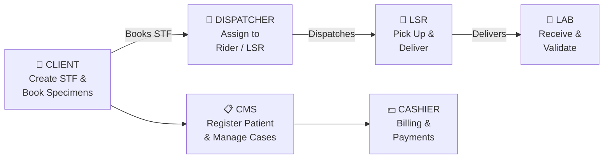

# MLLI — SPEC Documentation

Welcome to the official SPEC platform documentation. Select your role below to get started.

---

## Platform Workflow Overview

---

## Available Guides

| Role | Guide | Description |
|------|-------|-------------|
| 🏥 **Client** | [Client Guide](GUIDE_CLIENT.md) | Create STFs, add patients & procedures, book transmittals |
| 💵 **Cashier** | [Cashier Guide](GUIDE_CASHIER.md) | Patient billing, charge management, and payment processing |
| 🚀 **Dispatcher** | [Dispatcher Guide](GUIDE_DISPATCHER.md) | Manage and assign specimen deliveries to riders |
| 🧪 **Lab** | [Lab Guide](GUIDE_LAB.md) | Receive, verify, and process incoming specimens |
| 🚗 **LSR** | [LSR Guide](GUIDE_LSR.md) | Pick up and deliver specimens between facilities |
| 📋 **CMS** | [CMS Guide](GUIDE_CMS.md) | Patient registration and transaction management |

---

> **New here?** Start with your role's guide. Each guide covers login, step-by-step workflows, tips, and a visual flowchart of your process.

**Last Updated:** April 2026
